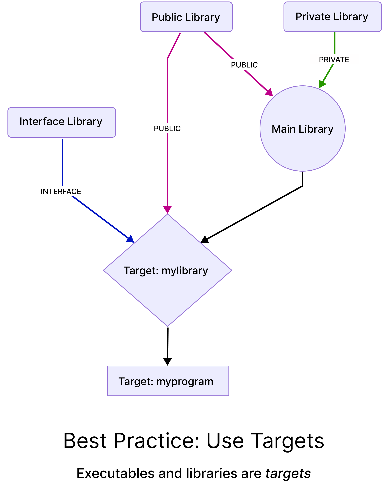

# 1. `CMake` variable best practices

## 1.1. If the `CMake` vars are used to store different `PATHS` as `string`

- [Official doc on CMake Variables](https://cmake.org/cmake/help/book/mastering-cmake/chapter/Writing%20CMakeLists%20Files.html#variables)

- For an example command (e.g. CMake `set` command)
```cmake
# From Doc
set(Foo "")      # 1 quoted arg -> value is ""
set(Foo a)       # 1 unquoted arg -> value is "a"
set(Foo "a b c") # 1 quoted arg -> value is "a b c"
set(Foo a b c)   # 3 unquoted args -> value is "a;b;c"


# 1.1.1 GOOD practices
The example CMake commands you see here (e.g. include_directories(), add_subdirectory()), just to show where those paths are heavily used.

# 1.1.1.1. for defining filepaths or dirs
set(MY_ABSOLUTE_PATH "/path/to/somewhere/else")

# 1.1.1.2. For appending/concatenating path with other path variable
include_directories("${STANDALONE_BINARY_DIR}/tools/toy-compiler/include")


# 1.1.2. NOT GOOD PRACTISE

# 1.1.2.1. Directly appending the path with other path var. No error, but better if you avoid it.
add_subdirectory(${STANDALONE_BINARY_DIR}/tools/toy-compiler/include)

# 1.1.2.2. Following example will directly result in unexpected behavior. DONOT USE IT.
add_subdirectory("${STANDALONE_BINARY_DIR}"/tools/toy-compiler/include)

```


# 2. Which one `add_subdirectory()` vs `add_library()` is to use for adding custom developed libs w.r.t MLIR?

`add_subdirectory()` and `add_library()` are both CMake `commands` that are used to organize and build projects. However, they have different purposes and are used in different situations.

## 2.1. `add_subdirectory()`:


`add_subdirectory()` is used to include another CMake project into the current project. This is useful for breaking down a large project into smaller, more manageable subprojects. When you use `add_subdirectory()`, you are essentially telling CMake to "go into" the specified directory and execute the `CMakeLists.txt` file that is located there. This file will then be responsible for building any targets that are defined in that subproject.


```sh
└── main-proj-dir # <= Your project-root
    ├── CMakeLists.txt # <= This is your PROJ_ROOT CMakeLists.txt config file. Because in the same layer, your entry point/program "main.cpp" exists.
    ├── main.cpp
    └── subdir-level-1
        ├── CMakeLists.txt
        └── subdir-level-2
            ├── CMakeLists.txt
            ├── external-subproject
            │   └── CMakeLists.txt
            └── subdirlevel-3

```

- **Adding a subdir to root `main-proj-dir/CMakeLists.txt`:** Let's assume, `subdir-level-1` is a subproject or a module which contains `subdir-level-1/CMakeLists.txt`. So now, if you want to add `subdir-level-1` to your root `main-proj-dir/CMakeLists.txt`, and then you want to propagate `commands`, `configs`, etc. to `subdir-level-1` then you have to add `add_subdirectory(subdir-level-1)` cmake `command` to your `main-proj-dir/CMakeLists.txt`.

- **Adding 1 subdir to another subdir (e.g. add `subdir-level-2` to `subdir-level-1`):** If you want to add `subdir-level-2` to `subdir-level-1`, exactly same process. Go to `main-proj-dir/subdir-level-1/CMakeLists.txt`, and add `add_subdirectory(subdir-level-2)`. **In such way, now root `main-proj-dir/CMakeLists.txt` recognize and can pass/propagate different commands, configs to `subdir-level-2`. So the connection chain is `main-proj-dir/CMakeLists.txt` --> `subdir-level-1/CMakeLists.txt` --> `subdir-level-2/CMakeLists.txt`**

- **Adding 1 external proj to a subdir (e.g. add `external-subproject` to `subdir-level-2`):** Whether it is an external proj/module or another subdir, the method is exactly same. Go to `main-proj-dir/subdir-level-1/subdir-level-2/CMakeLists.txt`, and add `add_subdirectory(external-subproject)`. You are done! Before adding, just check if the `external-subproject/` contains a `CMakeLists.txt`.

- **Condition to add a folder as a `subdirectory`:** This must have to have a `CMakeLists.txt`.

### 2.1.1. When to use `add_subdirectory()`?

- When you have a project that is structured in a hierarchical way (e.g. scaffold of `main-proj-dir` given above), with different subprojects representing different modules or components of the overall system. This can make it easier to manage the project, as you can focus on developing each subproject independently, and then build the entire system by building all of the subprojects.

### 2.1.2. How/Where should I use `add_subdirectory()`?

**2.1.2.1. Mainly for `lib/` dir containing `lib.cpp` files:**

- I use it to track all the `lib` folders; no matter, if they are organized in nested way, or in the same level. Because those libs have a lot of `cmake` commands to execute. E.g. Check the following table. I have shared only the most typical commands. Obviously there are much much more commands .. 😇

| Command                   | What it does                                                                                               |
|---------------------------|------------------------------------------------------------------------------------------------------------|
| `include_directories()`   | to include header file paths (i.e.  `-I /path/to/header/include/` ) in cmake compile commands              |
| `add_subdirectory()`      | This is useful for breaking down a large project into smaller, more manageable subprojects (i.e. subdirs). |
| `target_link_libraries()` | Targeting libraries to link with executables (i.e. `bin` or `exe`)                                         |
| `add_library()`           | Adding `shared` (i.e. `.so`) or `static` (`.a`) libs (could be external, or internal)                      |
| `add_executable()`        | For generating executables (i.e. `bin` or `exe`)                                                           |

**2.1.2.2. Sometimes for `include/`:**

Typically `include/` dirs never needed to be added by `add_subdirectory()`. But sometimes (very few), yes. When & for which cases 🤔? Let's discuss it with following example scaffold.

```sh
└── project-root
    ├── main.cpp # <= your project's main entry point
    ├── CMakeLists.txt
    ├── include
    │   ├── Dialect
    │   │   ├── Dialect.h
    │   │   └── Ops.td
    │   └── toy-analysis-parser
    │       ├── AST.h
    │       ├── Lexer.h
    │       └── Parser.h
    ├── lib
    │   ├── CMakeLists.txt
    │   ├── Dialect
    │   │   ├── CMakeLists.txt
    │   │   └── Dialect.cpp
    │   └── toy-parser
    │       ├── AST.cpp
    │       └── CMakeLists.txt
```

- **<ins>No use for `include` when...</ins>:**  In general, `include/` dirs only contains header files (`.h`, `.hpp`). Most commonly, they are just the files (e.g. `AST.h` or, `Parser.h`) containing declaration of `class`, `function()`, `#define`, etc; whereas the definitions are written in lib (e.g. `AST.cpp`) files. So they have nothing, which might need to be processed by any CMake `command`. That's why you just call it in your typical `AST.cpp` by `#include AST.h`. Or, the same header `AST.h` may be called/required by other header (e.g. `Parser.h`) or lib file/files. Or, even that other header file (e.g. `Parser.h`) might be eneded up by being called to your project's main entry point (e.g. `main.cpp`). And this is it 😛! You donot have to create `include/CMakeLists.txt` to track it as a `subdirectory`. Just you have to tell the proj-root's or lib's `CMakeLists.txt` file that, where is your `include/` dir is located. And you can do it by `include_directories("/path/to/include/")`. 

- **<ins>Use for `include` when...</ins>:** In some cases, `include/` dirs have to execute some cmake `commands` which might have something to do with the final build process. And for that, those `include/` dirs have to have a `CMakeLists.txt` file like `include/CMakeLists.txt`. Example? Have you ever seen header file with extension like `Ops.inc`, `Ops.h.inc` etc.? These kind of files are typically generated on-the-fly while the build is running. They could be `#includ`ed by some other `.h` or `.cpp` files. If those files are already not there in the disk for a given `/path/to/dynamic/include/`, you compilation might end up with error msg like `Dialect.h:7:10: fatal error: 'Ops.h.inc' file not found`. In such case, before your `clang++` or `g++` kicks in as scheduled by CMake, you have to tell CMake through `commands`, "Hey! generate those `.inc` files before the real compilation starts". Want to see an example? In MLIR (in `Toy lang` example code), you have to generate those kind of on-the-fly headers. So you have to execute the following commands in CMake for generating those files.

```cmake
set(LLVM_TARGET_DEFINITIONS Ops.td)
mlir_tablegen(Ops.h.inc -gen-op-decls)
mlir_tablegen(Ops.cpp.inc -gen-op-defs)
mlir_tablegen(Dialect.h.inc -gen-dialect-decls)
mlir_tablegen(Dialect.cpp.inc -gen-dialect-defs)
add_public_tablegen_target(ToyCh2OpsIncGen)
```
And where you have to put those commands? For example, you have `Dialect.h` located at `project-root/include/Dialect/Dialect.h`. Let's check with the same example scaffold. But this time, I've cut it short for your convenince.

```sh
└── project-root
    ├── main.cpp # <= your project's main entry point
    ├── CMakeLists.txt
    ├── include
    │   ├── Dialect # <= Virtually, here will be those ".inc" header files. But really? No 😉!
    │   │   ├── Dialect.h
    │   │   └── Ops.td
.........
...........
    ├── lib
    │   ├── CMakeLists.txt
    │   ├── Dialect
    │   │   ├── CMakeLists.txt
    │   │   └── Dialect.cpp
```

So now you have to create `/project-root/include/Dialect/CMakeLists.txt` and populate it with all those `commands`. Then you have to add another `CMakeLists.txt` at `/project-root/include/`. After that, add `add_subdirectory(Dialect)` in this `/project-root/include/CMakeLists.txt` file. Then finally in `project-root/CMakeLists.txt`, add `add_subdirectory(include)`. That's it. Now the chain is created, so that `project-root/CMakeLists.txt` tell the `/project-root/include/Dialect/CMakeLists.txt` to execute those `commands`.

The big job is done, but still you are not finished yet. You have to call the `alias` of (i.e. `ToyCh2OpsIncGen`) all those `mlir_tablegen()` commands at `/project-root/lib/Dialect/CMakeLists.txt` like following

```cmake
add_mlir_dialect_library(MLIRToyDialectCPP
    Dialect.cpp
    DEPENDS ToyCh2OpsIncGen
)
```
What this `DEPENDS ToyCh2OpsIncGen` is doing? **Before this library is called in the final compilation process,** cmake will start to generate those `.inc`, `.h.inc` on the fly ahead-of-time 🙂. For your convenience, I'm sharing the final project scaffold.
```sh
└── project-root
    ├── main.cpp
    ├── CMakeLists.txt
    ├── include
    │   ├── CMakeLists.txt # <== Newly added
    │   ├── Dialect
    │   │   ├── CMakeLists.txt # <== Newly added with ".inc" generator tablegen commands. Alias "ToyCh2OpsIncGen" is created for all those commands.
    │   │   ├── Dialect.h
    │   │   └── Ops.td
    │   └── toy-analysis-parser # <== But it has no "CMakeLists.txt", because it has no purpose of gen of ".inc" type of header files
    │       ├── AST.h
    │       ├── Lexer.h
    │       └── Parser.h
    ├── lib
    │   ├── CMakeLists.txt
    │   ├── Dialect
    │   │   ├── CMakeLists.txt # <== Dialect.cpp is calling the alias "ToyCh2OpsIncGen" as it's dependency to execute all tablegen commands first; before Dialect.cpp is called by final compile chain.
    │   │   └── Dialect.cpp
    │   └── toy-parser
    │       ├── AST.cpp
    │       └── CMakeLists.txt

```

Daunting 🙄? Little by little you will get to them. 

## 2.2. `add_library()`:

Is used to create a library target. `add_library()` typically used to build libraries that are either shared libraries (`.so` files) or static libraries (`.a` files). Shared libraries can be loaded at runtime, while static libraries are linked into the executable at compile time. This means that you are telling CMake to collect together a set of object files and link them together into a library. The library then can be used by other projects or applications.

is used to create a library target, which represents a collection of source files that are compiled and linked together to form a shared library (`.so`, `.dll`) or a static library (`.a`, `.lib`). Libraries can be used as dependencies for other executable targets or libraries. **So if we just want to build the shared libs, we `add_library()` is the choice.**


### 2.2.1 Some important components

**2.2.1.1. `DESTINATION`:** [Official doc](https://cmake.org/cmake/help/book/mastering-cmake/chapter/Install.html). **`DESTINATION` is an argument specifies the location where the installation rule will place files**, and must be followed by a directory path indicating the location. If the directory is specified as a full path, it will be evaluated at install time as an absolute path. If the directory is specified as a relative path, it will be evaluated at install time relative to the installation prefix. The prefix may be set by the user through the cache variable `CMAKE_INSTALL_PREFIX`.

E.g. Let's assume, our `cmake` config is in `build.sh` & being called by executing `/path/to/build.sh`. Here, `/path/to/` is an absolute path to `build.sh`. And inside that `build.sh` shell file,
```sh
# absolute path location to this file = /path/to/

# creating 2 dirs: "build/" and "installation/"
# and their abs path is "/path/to/build/" & "/path/to/installation/"
mkdir -p build installation

# then jumping to "/path/to/build/" dir, and start running "build.sh"
cd build/

# "-S ../" telling cmake that, all the source files are living in 1 level up from current dir, which is "/path/to/" dir
# "-B ." tells cmake, run the script from current dir, which is "/path/to/build/"; thanks to "cd build/" command earlier
# "-DCMAKE_INSTALL_PREFIX=../installation" tell cmake, go to 1 level up, then find `/path/to/installation/` dir, and finally dump all executables/libs there.
cmake   \
    -G Ninja    \
    -S ../  \
    -B .    \         
    -DCMAKE_INSTALL_PREFIX=../installation

```

For this example case, if `CMAKE_INSTALL_PREFIX=../installation`, then the final executables or lib files will be dumped to `/path/to/installation/` dir.
For the same example case, if the build dir specified by `-B`, then the final executables or lib files will be dumped to `/path/to/build/` dir.
So for both of the cases we can see that, those specified dirs are working in relative to the absolute path from where you are running `cmake -G Ninja -S ../ -B . -DCMAKE_INSTALL_PREFIX=../installation` command. Also you can explicitly specify the system paths like `/usr/local/lib/` or `/usr/local/bin/`. 

A platform-specific default is provided by CMake: `/usr/local` on UNIX, and `<SystemDrive>/Program Files/<ProjectName>` on Windows, where SystemDrive is along the lines of `C:` and `ProjectName` is the name given to the top-most project command.

**2.2.1.2. `TARGETS`:** Projects typically install some of the library and executable files created during their build process. The [`install()`](https://cmake.org/cmake/help/latest/command/install.html#command:install) command provides the `TARGETS` signature for this purpose.

The `TARGETS` keyword is immediately followed by a list of the targets created using [`add_executable()`](https://cmake.org/cmake/help/latest/command/add_executable.html#command:add_executable) or [`add_library()`](https://cmake.org/cmake/help/latest/command/add_library.html#command:add_library), which are to be installed. One or more files corresponding to each target will be installed.

**Files installed with this signature may be divided into categories such as `ARCHIVE`, `LIBRARY`, or `RUNTIME`. These categories are designed to group target files by typical installation destination.**

- **<ins>[CMake doc for `install` targets](https://cmake.org/cmake/help/book/mastering-cmake/chapter/Install.html#installing-targets)</ins>**

| Target file category | Target Category | CMake `command()` that create the Target file | `.ext` for `UNIX`                       | `.ext` for `Windows` | `.ext` for `Cygwin` & `MinGW` |
|----------------------|-----------------|-----------------------------------------------|-----------------------------------------|----------------------|-------------------------------|
| EXECUTABLE           | `RUNTIME`       | `add_executable()`                            | bin w/ no extension                     | `.exe`               |                               |
| STATIC_LIB           | `ARCHIVE`       | `add_library()` w/ `STATIC` option            | `.a`                                    | `.lib`               | `.a`                          |
| LOADABLE_MODULE_LIB  | `LIBRARY`       | `add_library()` w/ `MODULE` option            | `.so`                                   | `.dll`               |                               |
| SHARED_LIB           | `LIBRARY`       | `add_library()` w/ `SHARED` option           | `.so` on most `UNIX`, `.dylib` on `Mac` |                      |                               |
| DYNAMIC_LINK_LIB     | `RUNTIME`       | `add_library()` w/ `SHARED` option            |                                         | `.dll`               |                               |

- **<ins>Standard way to use them</ins>**

1. Consider a project that defines an executable, `myExecutable`, which links to a shared library `mySharedLib`. It also provides a static library `myStaticLib` and a plugin module to the executable called `myPlugin` that also links to the shared library. The executable, static lib, and plugin file may be installed individually using the commands.

Remember "The executable will not be able to run from the installed location until the shared library to it links to is also installed."

```cmake
install(TARGETS myExecutable DESTINATION bin)
install(TARGETS myStaticLib DESTINATION lib/myproject)
install(TARGETS myPlugin DESTINATION lib)
```

2. we have three different kinds of files created with a single target name `mySharedLib` that must be installed to three different destinations 😬! Fortunately, this problem can be solved using the category keyword arguments. The shared library may be installed using the command:

```cmake
install(TARGETS mySharedLib
        RUNTIME DESTINATION bin
        LIBRARY DESTINATION lib
        ARCHIVE DESTINATION lib/myproject)
```

### 2.2.2. When + How to use `add_library()`?

**2.2.2.1. Creating Shared Libraries (`.so` files):** Shared libraries are dynamically loaded at runtime, allowing multiple applications to share the same code efficiently. Use `add_library()` with the `SHARED` keyword to create shared libraries.

**Example:**
Let's see an example `CMakeLists.txt` for creating a `SHARED` lib. **DONOT FORGET TO PASS `-DBUILD_SHARED_LIBS=ON` IN YOUR BUILD CONFIG**

```cmake
# This example creates a shared library called "my_library" from the source file "my_source.cpp" and the header file "my_header.h". The library is installed in the "lib" directory.
# Including header files in the add_library() command is not strictly necessary, but recommended. Because we know, which header file is this lib is using. Help to track the dependency.
add_library(my_library SHARED
    my_source.cpp
    my_header.h
)

# Specifying include directories for a specific target "my_library". Means that, the specified directory "include/" will only be added to the compiler's search path for that specific target "my_library". This is useful for libraries that define their own header files that should only be visible to the library itself and its dependents.
# "PUBLIC" means, the "include/" directory will be visible to all targets that link to the "my_library" target. This means that if you create another target, such as an "executable", and link it to the "my_library" target, then the "executable" will also have access to the header files in the "include/" directory.
target_include_directories(my_library PUBLIC include)

# install() command installs the library in the "lib/" dir. This ensures that the library is available to other applications on the system.
install(TARGETS my_library
    LIBRARY DESTINATION lib
)
```

- How to use `my_library` with a project?
```cmake
find_library(my_library_path NAMES my_library)
target_link_libraries(my_executable PUBLIC my_library_path)
```

**2.2.2.2. Creating Static Libraries (`.a` files):** Static libraries are linked into the executable at compile time, reducing the number of files to load and improving performance. Use `add_library()` with the `STATIC` keyword to create static libraries.

**Example:**
Example `CMakeLists.txt` for creating a `STATIC` lib.

```cmake
# "STATIC" keyword is used here. Rest of the ideas are like shared lib.
add_library(my_static_library STATIC
    my_source.cpp
    my_header.h
)

target_include_directories(my_static_library PUBLIC include)

# Install the static library
install(TARGETS my_static_library
    ARCHIVE DESTINATION lib
)
```

**2.2.2.3. `Shared lib` vs `Dynamic-link lib (DLL)`? which one to use?**

- **<ins>Shared lib</ins>**
Shared libraries are dynamically linked at runtime, which means that the code from the library is not actually embedded in the executable file. Instead, the executable file only contains references to the library. When the executable file is run, the operating system loads the library from disk and links it to the executable file in memory.
This has several advantages:
1. Reduced executable size
2. Increased portability
3. Improved performance: By sharing the code between multiple processes. This can be particularly beneficial for applications that are run on multi-core systems.

- **<ins>Dynamic-link lib (DLL)</ins>**
DLLs are a type of shared library that **is specifically designed for Windows**. DLLs are loaded by the operating system when an application that depends on them is run.


## 2.3. `add_subdirectory()` vs `add_library()` which one to use?

So finally... 

`add_subdirectory()` is for managing project structure and integrating subdirectories, while `add_library()` is for creating and managing library targets.


# 3. What are the differences between different access specifiers type `PUBLIC` vs `PRIVATE` vs `INTERFACE` for libraries in the context of MLIR?

## 3.1. `PUBLIC` libraries:
Most widely visible and accessible type of library. **They are designed to be used by other libraries or applications, and they export all of their symbols (`functions`, `types`, `variables`) to the outside world.** Means that, any other library or application that linked against a public library, can access the public lib through `functions`, `types`, `variables` (i.e. `symbols`). Public libraries are typically used for general-purpose functionality that is intended to be shared by multiple projects.

MLIR has a number of public libraries such as `Pass Manager (PM)`, `Dialects` (i.e. `LLVM dialect`, `Affine dialect`, `Loop dialect`, `Arithmetic dialect` etc.), `Bindings`, etc.


## 3.2.`PRIVATE` libraries:
are designed to be used only by the library itself and its immediate dependencies. They do not export any of their symbols (`functions`, `types`, `variables`) to the outside world. And they can only be linked against by other libraries or applications that are explicitly marked as `PRIVATE` dependencies. Means, if we are declaring a lib as `PRIVATE`, and if this lib has dependencies with other libs, then those libs should be linked with our `PRIVATE` lib by explicitly declaring them as `PRIVATE` dependencies. **This is useful for hiding implementation details and preventing accidental symbol conflicts.** Also **`PRIVATE` libraries are typically used for libraries that contain proprietary or sensitive code.**

In other words, `PRIVATE` libraries are designed to be used by a specific group of people and they don't want to share their code with the outside world. This is because the code might be proprietary or sensitive, or because the library needs to be very tightly controlled.


### 3.2.1 More Easy way to Understand `PRIVATE` libs

**Example analogy 1:** Private libraries are like secret clubs. Only the people who are allowed in (the library itself and its immediate dependencies) can see what's inside. They don't tell anyone else what they're doing, and they don't want anyone else to mess with their stuff.

**Example analogy 2:** Imagine we're writing a secret recipe for a new type of cake. We don't want just anyone to be able to make our cake, so we keep the recipe private. Only we and our closest friends know how to make it. `PRIVATE` libs are similar. They're like secret recipes for code. **Only the library itself and its immediate dependencies know how to use them.**

**Usage example:**

**Q.** Does that mean, if I want to use external library with my PRIVATE library, then those external library has to be declared as PRIVATE dependencies?
**Ans:** YES! And the way to use that is following:

```cmake
add_library(my_private_library PRIVATE external_library)
```

## 3.3.`INTERFACE` libraries:
They are typically used to declare an API that other libraries or applications can conform to. This allows developers to use the API of an interface library without having to worry about the underlying implementation details. Interface libraries are typically used for libraries that are still under development or that are intended to be used by multiple projects with different implementation requirements.


**Usage example:**

Eigen: Eigen is another popular C++ library for numerical computation, with a focus on matrix operations. To target Eigen with the INTERFACE keyword, we can use the following CMake code:

```cmake
find_package(Eigen3 REQUIRED)

target_link_libraries(my_target INTERFACE Eigen3::Eigen3)
```


## 3.4. `cmake` STANDARD LIBRARY ORGANIZATION (BEST PRACTICE)

I have collected the following diagram from ["CMake: Best Practices" by Henry Schreiner , slide - 22](https://indico.jlab.org/event/420/contributions/7961/attachments/6507/8734/CMakeSandCroundtable.slides.pdf).

From this diagram, you can assume `Target: myprogram` as your `toy-compiler`.

<!--  -->
<!--  -->



## 3.5. How to use `PUBLIC`, `PRIVATE` and `INTERFACE`?

### A must read [CMake: Public VS Private VS Interface](https://leimao.github.io/blog/CMake-Public-Private-Interface/) 🙂🙂🙂


# 4. Difference between `include_directories()` vs `target_include_directories()`?

## 4.1.  `include_directories()`:
Is used to specify global include directories. This means that the specified directories will be added to the compiler's search path for all targets in the project. **This is useful for project-level header files that should be visible to all targets**.


## 4.2.  `target_include_directories()`:
is used to **specify include directories for a specific target, such as an executable or a library**. This means that the specified directories will only be added to the compiler's search path for that specific target. This is useful for libraries that define their own header files that should only be visible to the library itself and its dependents.

```cmake
target_include_directories(my_library PUBLIC include)
```