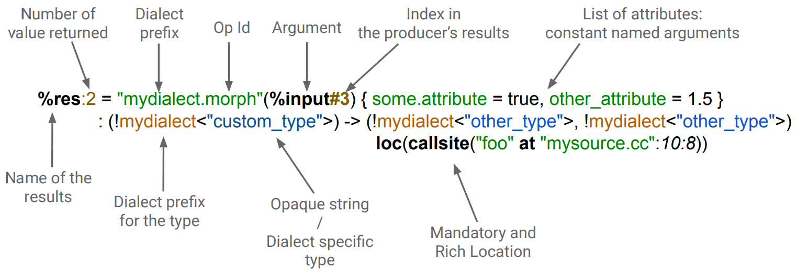

# 1. What is Dialect with respect to MLIR?

Taking from [official MLIR Dialect Doc](https://mlir.llvm.org/doxygen/classmlir_1_1Dialect.html#:~:text=Detailed%20Description-,Dialects%20are%20groups%20of%20MLIR%20operations%2C%20types%20and%20attributes%2C%20as,loaded%20in%20a%20specific%20MLIRContext.)

> Dialects are `groups` of MLIR `operations`, `types` and `attributes`, as well as `behavior` associated with the entire group.
> For example, hooks into other systems for constant folding, interfaces, default named types for asm printing, etc.
> Instances of the dialect object are loaded in a specific [MLIRContext](https://mlir.llvm.org/doxygen/classmlir_1_1MLIRContext.html).

Simply speaking,

An MLIR dialect is a customized version of MLIR that is tailored to a specific domain or application. Dialects are used to introduce domain-specific abstractions and constructs. Dialects provide a way to extend the expressiveness of MLIR by introducing new `types`, `operations`, and `attributes`. This makes it possible to express domain-specific concepts in a more natural and concise way.

For example, there can be a dialect for representing operations from a specific hardware architecture, a dialect for a specific programming language, or a dialect for optimizations.

MLIR dialects are typically developed by communities of users who are working on specific domains or applications. These communities work together to define the syntax and semantics of the dialect, as well as to provide tools and libraries for using the dialect. Also you can design your own dialect.

# 2. Building blocks of MLIR Dialect?

As per [official doc](https://mlir.llvm.org/doxygen/classmlir_1_1Dialect.html#:~:text=Detailed%20Description-,Dialects%20are%20groups%20of%20MLIR%20operations%2C%20types%20and%20attributes%2C%20as,loaded%20in%20a%20specific%20MLIRContext.) there 
There are 3 fundamental building block of MLIR Dialect

## 2.1. `Operations`
An `Operation` (a.k.a. `Ops`) is the smallest executable unit in MLIR. It represents an individual computation or transformation. They are the fundamental building blocks in MLIR. Each `operation` belongs to a specific dialect. They define computations, transformations, or annotations.

## 2.2. `Types`
`Types` are used to describe the `shape` and `nature` of data in MLIR. Like operations, types can be specific to a dialect.

## 2.3. `Attributes`
`Attributes` provide additional information associated with operations. For instance, constant values can be represented as attributes.

[Slide-14](https://users.cs.utah.edu/~mhall/mlir4hpc/pienaar-MLIR-Tutorial.pdf) gives a nice view of `Operation` with all of it's components.

